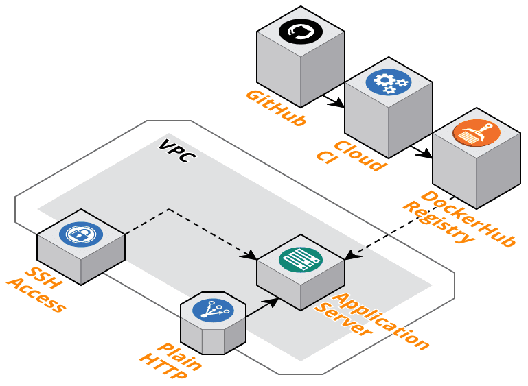

## Sharpen Your Skills

> A code kata is an exercise in programming which helps programmers hone their skills through practice and repetition.

The purpose of this site is to provide some Katas for doing DevOps.
Things, one may work with every day: infrastructure, servers provisioning, build and deployment automation.

Different organisations have their own tools. And there are many more tools in the Internet.
Battle-proofed ones and brand new. But the tasks are usually the same: deploy XXX to YYY, create infra for ZZZ at AAA IaaS provider.

See the list of simple exercises that will try _your_ tools in real battle and sharpen your skills in a real-world task.

### Kata 1: A simple web application

Given a simple random quotes application ([Ruby on Rails](https://github.com/DevOps-Kata/sample-rails-app)).

A customer wants to:
- deploy it to a cloud;
- automated infrastructure formation;
- and server provisioning;

One should make it happen with any tools of choice.

